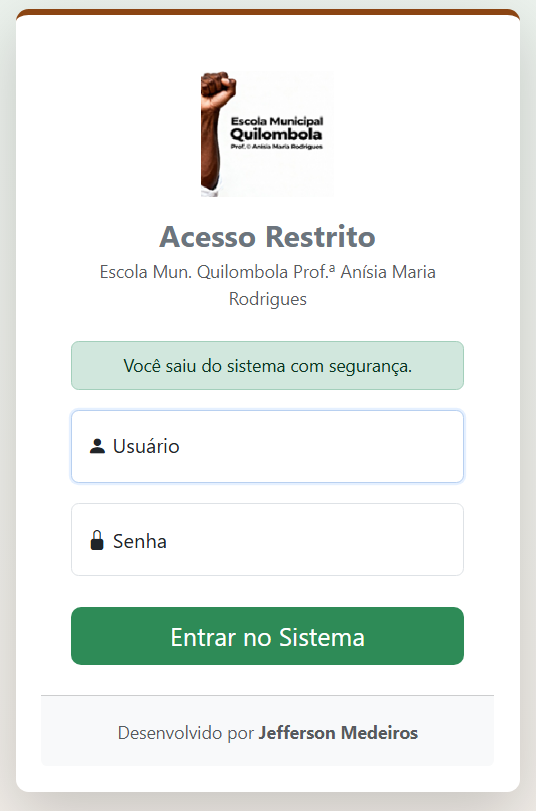
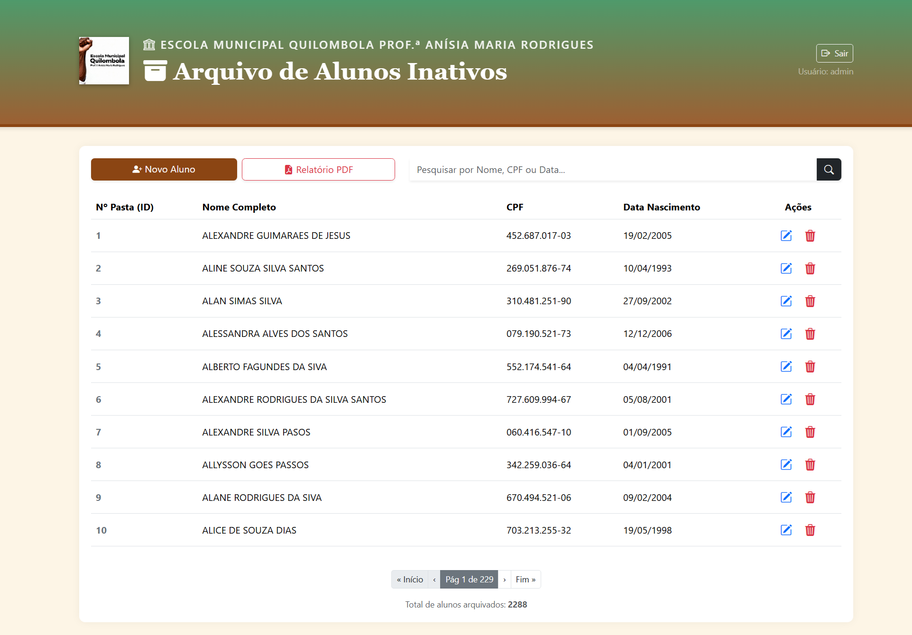

# 🏫 Sistema de Gestão de Arquivos - Escola Quilombola


> Sistema desenvolvido para a **Escola Municipal Quilombola Prof.ª Anísia Maria Rodrigues** para organizar, digitalizar e facilitar a consulta de pastas de alunos inativos.

---

## 📖 Sobre o Projeto

Este projeto é uma aplicação **Full Stack** robusta desenvolvida para resolver o problema de gestão de arquivos físicos. O sistema permite cadastrar alunos inativos, gerando um ID único que corresponde à pasta física no arquivo morto, facilitando a localização e organização.

A aplicação conta com uma identidade visual personalizada, respeitando as cores e a cultura da escola, e possui sistema de login seguro.

---

## ✨ Funcionalidades Principais

* **🔐 Segurança Completa:** Autenticação via Login e Senha (Spring Security).
* **📂 CRUD Completo:** Cadastro, Listagem, Edição e Exclusão de alunos.
* **🔍 Busca Inteligente:** Pesquisa unificada por **Nome**, **CPF** ou **Data de Nascimento**.
* **📄 Relatórios em PDF:** Geração automática de relatórios listando todos os alunos arquivados.
* **⚡ Importação de Dados Legados:** Rotina automática que lê arquivos CSV antigos e popula o banco de dados, mantendo a numeração das pastas físicas.
* **🚀 Paginação:** Navegação otimizada para milhares de registros.
* **✅ Validações:** Verificação de CPF válido e campos obrigatórios.
* **🎨 Identidade Visual:** Interface moderna, responsiva e customizada com tema Quilombola.
* **🐳 Containerização:** Pronto para rodar em qualquer lugar com Docker e Docker Compose.

---

## 🛠️ Tecnologias Utilizadas

* **Backend:** Java 17, Spring Boot 3.3, Spring Data JPA, Spring Security.
* **Frontend:** Thymeleaf, HTML5, CSS3, Bootstrap 5.
* **Banco de Dados:** PostgreSQL (Produção), H2 (Desenvolvimento).
* **Ferramentas:** Maven, Docker, Docker Compose, Git.
* **Libs Extras:** OpenPDF (Relatórios), OpenCSV (Importação de Dados).

---

## 📸 Screenshots

|                               Tela de Login                               |                    Lista de Alunos (Tela principal)                    |
|:-------------------------------------------------------------------------:|:----------------------------------------------------------------------:|
|  <br> *(Exemplo 01)* |  <br> *(Exemplo 02)* |

---

## 🚀 Como Rodar o Projeto Localmente

### Pré-requisitos
* Java 17 JDK
* Maven
* Docker (Opcional, mas recomendado para o Banco de Dados)

### Passo a Passo

1.  **Clone o repositório:**
    ```bash
    git clone https://github.com/morpheolinkin/InactiveArchive.git
    cd InactiveArchive
    ```

2.  **Suba o Banco de Dados (via Docker):**
    ```bash
    docker-compose up -d
    ```

3.  **Execute a Aplicação:**
    ```bash
    mvn spring-boot:run
    ```
    *A aplicação iniciará na porta `8080`.*

4.  **Acesse no Navegador:**
    * URL: `http://localhost:8080/alunos`

### 🔑 Credenciais de Acesso

Para acessar o sistema, utilize o usuário administrativo padrão:

* **Usuário:** `inep`
* **Senha:** `29057140`

---

## ☁️ Deploy (Produção)

O projeto está configurado com **Dockerfile** otimizado para nuvem.
Atualmente, pode ser hospedado em serviços como **Render**, **Railway** ou **AWS**.

### Variáveis de Ambiente Necessárias (Prod):
* `SPRING_PROFILES_ACTIVE`: `prod`
* `SPRING_DATASOURCE_URL`: `jdbc:postgresql://HOST:PORT/DB_NAME`
* `SPRING_DATASOURCE_USERNAME`: `seu_usuario`
* `SPRING_DATASOURCE_PASSWORD`: `sua_senha`

---

## 👨‍💻 Desenvolvedor

<table>
  <tr>
    <td text-align="center">
      <a href="https://linkedin.com/in/jefferson-morpheus">
        <br>
        <sub>
          <b>Jefferson Medeiros da Silva</b>
        </sub>
      </a>
    </td>
  </tr>
</table>

Feito com ❤️ e Java.

[](https://linkedin.com/in/jefferson-morpheus)